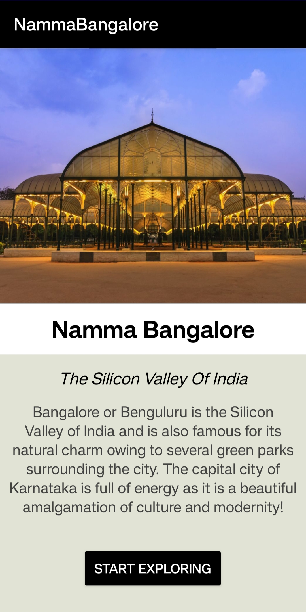
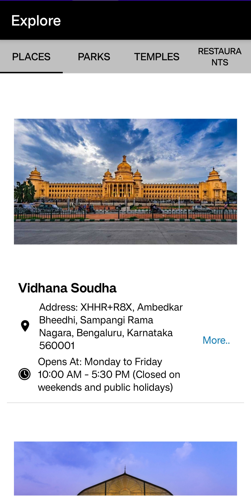
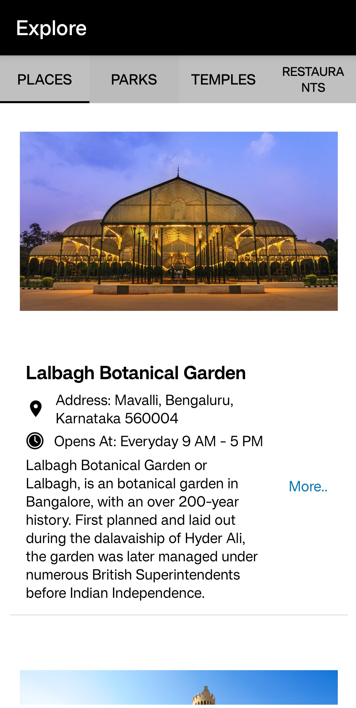
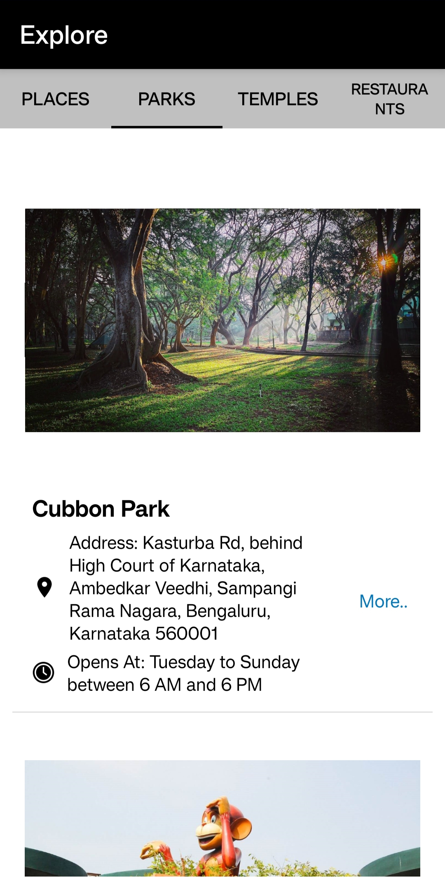
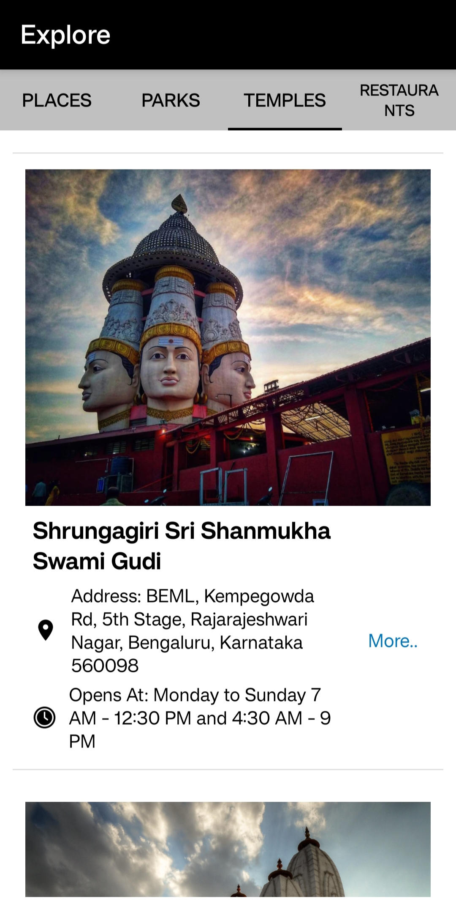
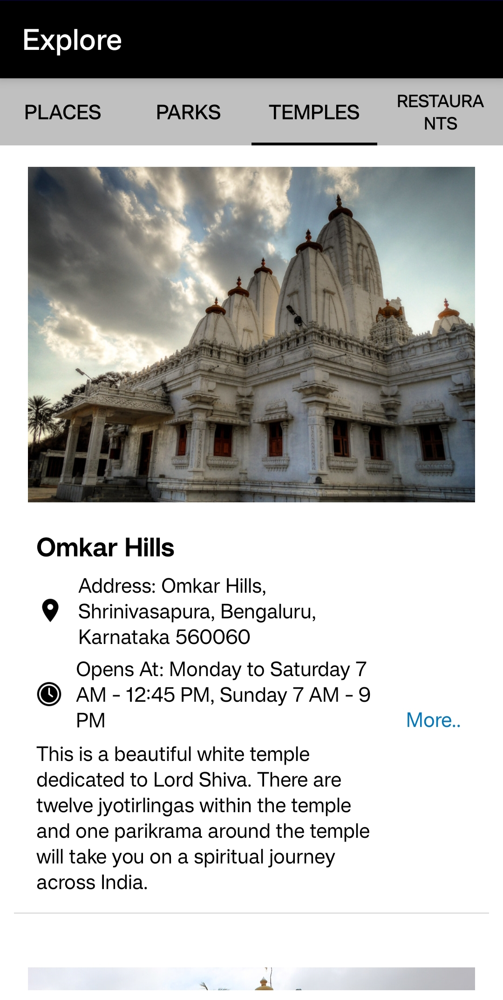
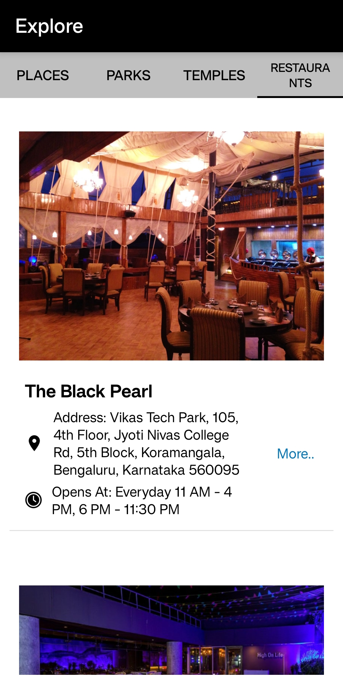
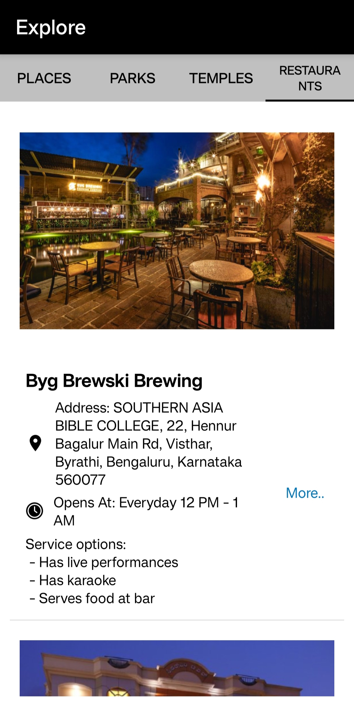
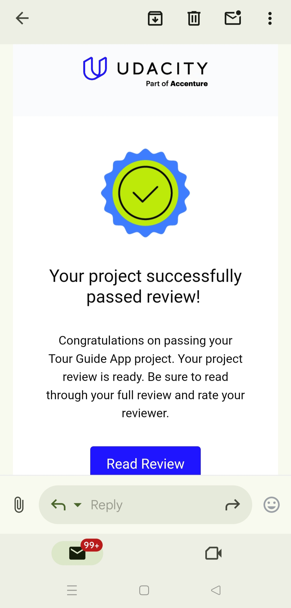

# 📌 Tour Guide App: Namma Bangalore

This app was developed as part of the **Android Basics: Multi-Screen Apps** course, a module in the **Udacity Android Basics Nanodegree** program.

## 📖 Project Overview

The goal was to create a **Tour Guide App** which presents relevant information to a user who’s visiting your city. The app can list **top attractions, restaurants, public places, or events** for the city. It can contain all the **best-known secrets that only locals know**.

---

## ✅ Requirements Followed

The app must include the following:

✔ Planning the app design and navigation before coding  
✔ Selecting proper data structures to store lists of information  
✔ Building layouts to display those lists of data  
✔ Navigating between lists in Fragments using either a **ViewPager plus TabLayout** or **Navigation Drawer***  
✔ Creating your own custom classes  
✔ Properly handling images  
✔ User navigates between lists in Fragments using either a **Navigation Drawer** or a **ViewPager plus TabLayout**  
✔ App contains at least **4 lists** of relevant attractions for a location  
✔ Each list item contains information about an event, restaurant, historical site, or similar  
✔ At least one list includes pictures of the location  
✔ App uses a **custom adapter** to populate the layout with views based on instances of the custom class  
✔ App contains a **custom object** for storing location information  

---

## 📱 Screens of the App

The **Namma Bangalore** app features a **beautiful and visually appealing UI design**, enhancing the overall user experience.

On the **Home screen**, after clicking **"Start Exploring,"** the user is navigated to the Explore screen, which offers various categories such as **Places, Parks, Temples, and Restaurants**.  

Each place is displayed with an **image**, followed by its **address** and **visiting hours**.  A **"More"** button is available, allowing users to view a short **description** of the selected place.  

The app's UI is **fully responsive**, ensuring a seamless and optimal viewing experience across various screen sizes and devices.

### 🖼️ Screenshots  
   &nbsp;&nbsp;&nbsp;&nbsp;&nbsp;&nbsp;&nbsp;&nbsp;
  &nbsp;&nbsp;&nbsp;&nbsp;&nbsp;
  &nbsp;&nbsp;&nbsp;&nbsp;&nbsp;&nbsp;&nbsp;&nbsp;
  &nbsp;&nbsp;&nbsp;&nbsp;&nbsp;&nbsp;&nbsp;&nbsp;
  &nbsp;&nbsp;&nbsp;&nbsp;&nbsp;&nbsp;&nbsp;&nbsp;
  &nbsp;&nbsp;&nbsp;&nbsp;&nbsp;&nbsp;&nbsp;&nbsp;
  &nbsp;&nbsp;&nbsp;&nbsp;&nbsp;&nbsp;&nbsp;&nbsp;
  
          
---

## ⭐ Review from Udacity

  
  
